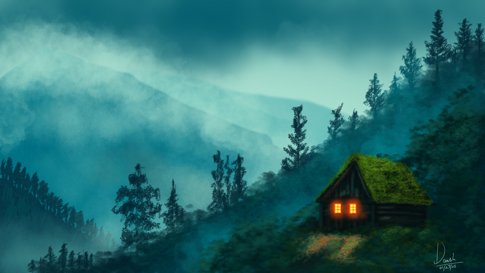
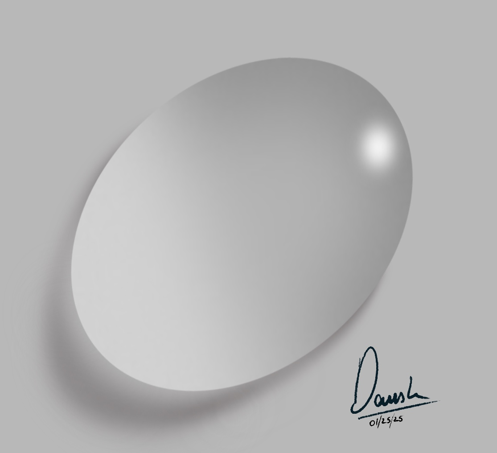

*Just started making some new art after like 4 years, hope to continue this hobby in the future*

## Misty Mountain Cabin 
*January 27th, 2025*

My first decent attempt at creating a landscape *painting* in Procreate. Once again I followed a [tutorial](https://www.youtube.com/watch?v=fCVJcZpB6BQ) that helped me make this and get comfortable with using Procreate. I'm mostly happy with how the background turned out, I think the mountains look amazing. I'm somewhat not happy with the cabin lights and the surrounding area to it. Hope to do a better job in the next one. However, my friends think the artwork looks AI-generated. I guess that's a compliment in this day and age.

*A serene cabin with glowing windows nestled on a misty mountainside, surrounded by lush pine trees under a dreamy blue haze.* (caption generated by ChatGPT)

## Waterdrop 
*January 25th, 2025*

Just a simple waterdrop made in Procreate, wasn't really hard to be honest. I'm finally learning to use Procreate. Its an amazing app I must say!
I followed this [tutorial](https://www.youtube.com/watch?v=uqyYDjADkOo), it taught me the basics of Procreate and reminded me of basic optical Physics.

