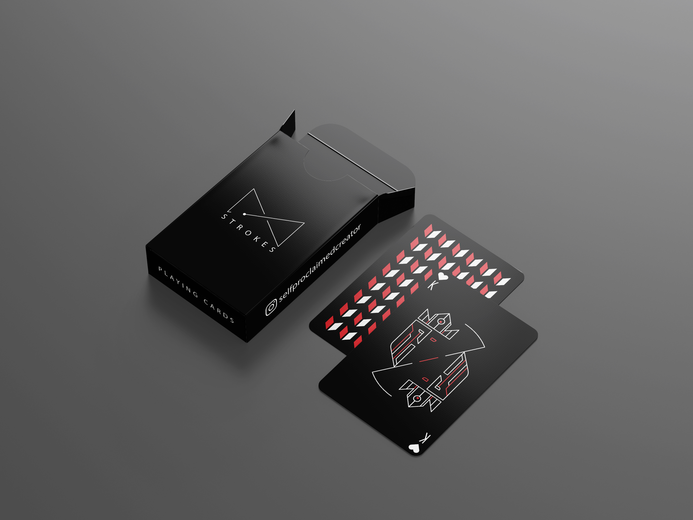
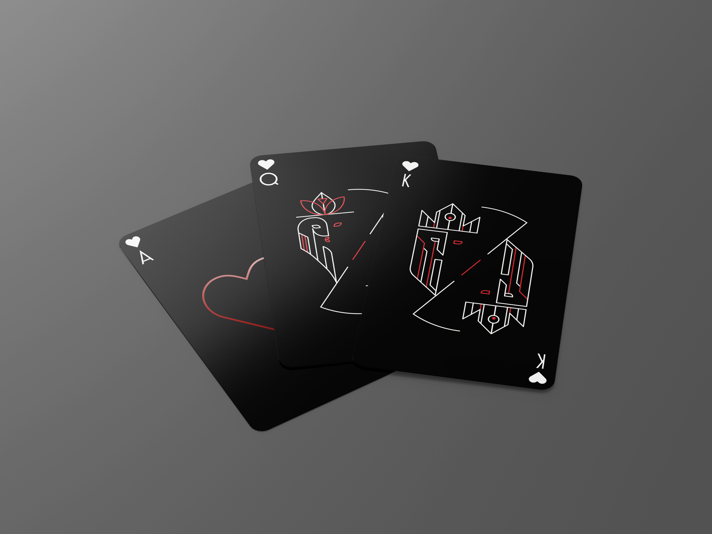
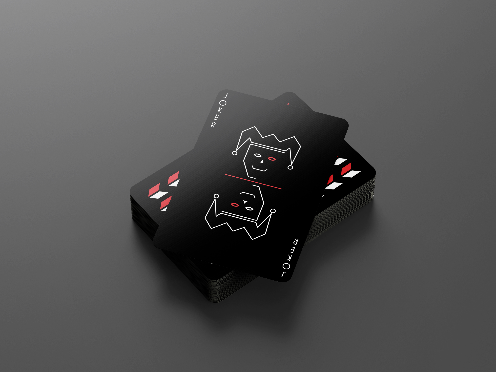
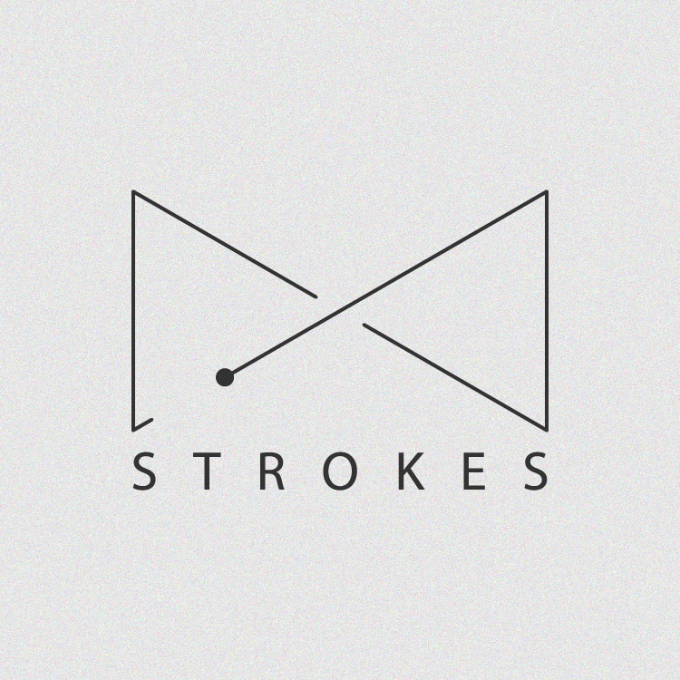
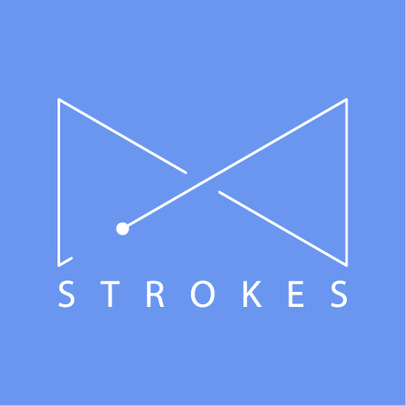

This is a really old work of mine! 

It was during COVID in 2020-21. I just wanted to give graphic designing a shot and was getting
pretty good at it, so I decided to design my own deck of cards. 

Turns out designing 52 cards is extremely repititive and it got boring pretty quickly, I never really got to finish the
whole deck, however I did make some mockups back in the day just to get a feel of things.

Here are some of the mockups, I made them in Photoshop.

Maybe some-day I will get back to finishing this and actually print a couple sets out to give to close friends and family.

This is also the time where I decided to design my logo, the same one that you will find as the icon of this site

This logo is actually a spin on the classic infinity symbol but a little boxy and rigid(for artistic temparament I suppose)

Here's some of the variations I made, the one with the gray background is my favorite!

